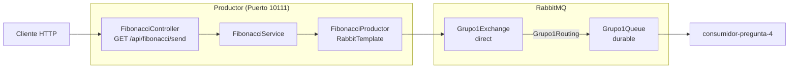

# productor-pregunta-4 - Productor RabbitMQ

Evaluacion T1 del curso **Desarrollo de Aplicaciones Web II**  
Instituto Superior Tecnologico Cibertec  
Grupo 1

---

## Integrantes del Grupo

| N° | Apellidos y Nombres | Grupo |
|:--:|---------------------|:-----:|
| 1 | Chaupis Alvarez Jhonny Samuel | 1 |
| 2 | Hinojosa Cano Carlos Daniel | 1 |
| 3 | Hurtado Sernaque Brayan Luis | 1 |
| 4 | Alayo Oliveros Mathias Miller | 1 |

---

## Descripcion del Proyecto

Microservicio en Spring Boot que expone un endpoint REST para recibir una lista de numeros separados por `;`
y publicarla como texto plano en RabbitMQ. El procesamiento (calculo de Fibonacci) lo realiza el proyecto
`consumidor-pregunta-4` de forma asincrona.

---

## Entorno y Requisitos Tecnicos

- **Lenguaje:** Java 25
- **Framework:** Spring Boot 4.1.1
- **Librerias principales:** Spring AMQP, Spring Web MVC, Lombok
- **Gestor de construccion:** Apache Maven 3.9+ (o Maven Wrapper incluido)
- **Broker:** RabbitMQ en `localhost:5672` (`guest` / `guest`)
- **Puerto de ejecucion:** 10111

---

## Endpoint y Contrato RabbitMQ

- **Endpoint expuesto:** `GET /api/fibonacci/send?numbers={lista}`
- **URL local:** `http://localhost:10111/api/fibonacci/send?numbers=1;2;15;8`
- **Respuesta:** `Lista enviada a RabbitMQ correctamente`
- **Exchange:** `Grupo1Exchange` (direct)
- **Queue:** `Grupo1Queue` (durable)
- **Routing key:** `Grupo1Routing`
- **Formato del mensaje:** `String` plano, por ejemplo `1;2;15;8`
- **Componentes:**
  - `FibonacciController`: Controlador REST que expone la ruta `/api/fibonacci/send`.
  - `FibonacciService`: Capa de negocio que delega el envio.
  - `FibonacciProductor`: Publica el mensaje con `RabbitTemplate.convertAndSend`.
  - `RabbitMqConfig`: Declara exchange, cola y binding como `@Bean`.

---

## Diagrama de Componentes



---

## Compilacion y Ejecucion

### Prerrequisitos

- Java Development Kit (JDK) 25 configurado en la variable `JAVA_HOME`.
- RabbitMQ levantado con el plugin de administracion (consola en `http://localhost:15672`).

### Pasos de Ejecucion

1. Clonar el repositorio:
```bash
git clone https://github.com/jmalayo-dev/productor-pregunta-4.git
cd productor-pregunta-4
```

2. Compilar el proyecto con Maven Wrapper:
- En entornos Unix (Linux / macOS):
```bash
./mvnw clean compile
```
- En entornos Windows:
```cmd
mvnw.cmd clean compile
```

3. Iniciar la aplicacion:
- En entornos Unix (Linux / macOS):
```bash
./mvnw spring-boot:run
```
- En entornos Windows:
```cmd
mvnw.cmd spring-boot:run
```

La aplicacion quedara escuchando peticiones en `http://localhost:10111`.

---

## Ejemplos de Prueba

```bash
curl "http://localhost:10111/api/fibonacci/send?numbers=1%3B2%3B15%3B8"
```

En Postman: `GET http://localhost:10111/api/fibonacci/send` con el parametro `numbers` = `1;2;15;8`.

Con el consumidor apagado, el mensaje queda en la consola de RabbitMQ en
**Queues and Streams → Grupo1Queue** (columna **Ready**).

---

## Resultados de las Pruebas

Pruebas realizadas el 27/09/2026 sobre un clon limpio del repositorio, junto con `consumidor-pregunta-4`.

| Prueba | Resultado |
|--------|-----------|
| Compilacion y test `contextLoads` (`./mvnw package`) | OK |
| Arranque con `./mvnw spring-boot:run` en el puerto 10111 | OK |
| Topologia en RabbitMQ (`Grupo1Exchange` → `Grupo1Queue` con `Grupo1Routing`) | OK |
| `GET /api/fibonacci/send?numbers=1;2;15;8` | HTTP 200 en ~2 ms: `Lista enviada a RabbitMQ correctamente` |
| Envio de varios mensajes seguidos | Todas las respuestas inmediatas; el productor no espera al consumidor |

Log obtenido:

```
FibonacciProductor : Enviando numeros A RabbitMQ: 1;2;15;8
```
